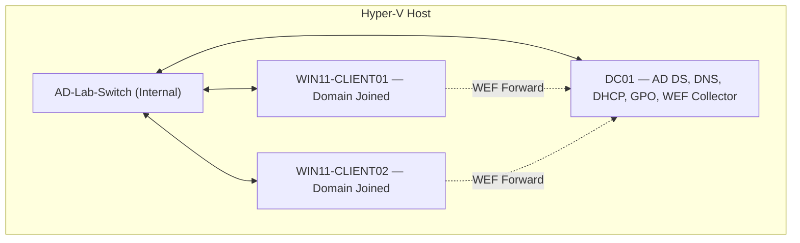

# AD-HomeLab


A fully scripted, portfolio-grade Active Directory home lab built on Hyper-V with Windows Server 2022 and Windows 11 Pro clients, plus a cross-platform Expo dashboard for web, iOS, and Android.

## Quick Start (5 commands)

```powershell
# 1. Provision VMs (Hyper-V host, as Admin)
.\hyperv\Provision-All.ps1

# 2. Attach installation media and stage unattend media
.\hyperv\04-Attach-ISO.ps1 -ServerISO C:\path\to\Server2022.iso -Win11ISO C:\path\to\Win11.iso

# 3. Setup domain controller (on DC01, as Admin)
.\scripts\01-Setup-DC.ps1

# 4. Configure GPOs + security (on DC01)
.\scripts\03-Configure-GPOs.ps1
.\scripts\06-Harden-Baseline.ps1

# 5. Create users + validate (on DC01)
.\scripts\04-Create-Users.ps1
.\scripts\05-Validate-Lab.ps1
```

See [PROJECT.md](PROJECT.md) for full documentation, prerequisites, and step-by-step instructions.

## What's Inside

| Component | Description |
|-----------|-------------|
| `hyperv/` | Hyper-V VM provisioning + installation media staging |
| `scripts/` | DC setup, domain join, GPOs, security, users, monitoring, backup, RBAC |
| `dsc/` | Desired State Configuration (declarative alternative) |
| `modules/` | ADHomeLab PowerShell module (shared functions) |
| `data/` | User CSV + monitored events dataset |
| `tests/` | Pester tests with AD/GPO mocks + syntax validation |
| `docs/` | Architecture diagrams, runbooks, security baseline, cost analysis |
| `config/` | GPO export directory |
| `vagrant/` | Vagrant alternative with Hyper-V provider |
| `apps/mobile-web/` | Expo React Native dashboard for web, iOS, and Android |
| `.github/workflows/` | CI: PSScriptAnalyzer + Pester |

## Architecture



See [docs/architecture.mmd](docs/architecture.mmd) for the full diagram.

## Status

- **Hypervisor**: Hyper-V (Windows 11 host)
- **Domain**: homelab.local
- **VMs**: DC01 (AD DS, DNS, DHCP), WIN11-CLIENT01, WIN11-CLIENT02
- **GPOs**: 8 total (USB restriction, password policy, ASR, firewall, banner, etc.)
- **Users**: 50 bulk-created AD accounts via PowerShell
- **Security**: STIG/CIS-inspired hardening (NTLMv2, SMB signing, ASR, audit)
- **RBAC**: 7 security groups with OU-level delegation
- **Monitoring**: Windows Event Forwarding + alert scheduled tasks
- **DR**: Backup/restore scripts with RPO/RTO documentation

## Documentation

| Document | Description |
|----------|-------------|
| [PROJECT.md](PROJECT.md) | Full project documentation |
| [docs/architecture.mmd](docs/architecture.mmd) | Mermaid architecture diagram |
| [docs/security-baseline.md](docs/security-baseline.md) | STIG/CIS control mapping |
| [docs/security-dashboard.md](docs/security-dashboard.md) | Monitoring & WEF documentation |
| [docs/backup-strategy.md](docs/backup-strategy.md) | RPO/RTO and recovery procedures |
| [docs/rbac-matrix.md](docs/rbac-matrix.md) | Delegation matrix |
| [docs/cost-analysis.md](docs/cost-analysis.md) | Cloud vs on-prem cost comparison |
| [docs/demo-script.md](docs/demo-script.md) | Interview walkthrough |
| [docs/runbooks/](docs/runbooks/) | 6 operational runbooks |
| [apps/mobile-web/README.md](apps/mobile-web/README.md) | Cross-platform dashboard usage and security model |

## Dashboard App

The Expo dashboard turns the lab into a mobile-friendly operations console with screens for build phases, script safety, validation checks, security controls, and runbooks.

```powershell
cd apps/mobile-web
npm install
npm run web
```

The dashboard is intentionally read-only. It does not execute privileged PowerShell from web or mobile; use it as a command reference and runbook interface unless a secured backend agent is added later.

## License

MIT
